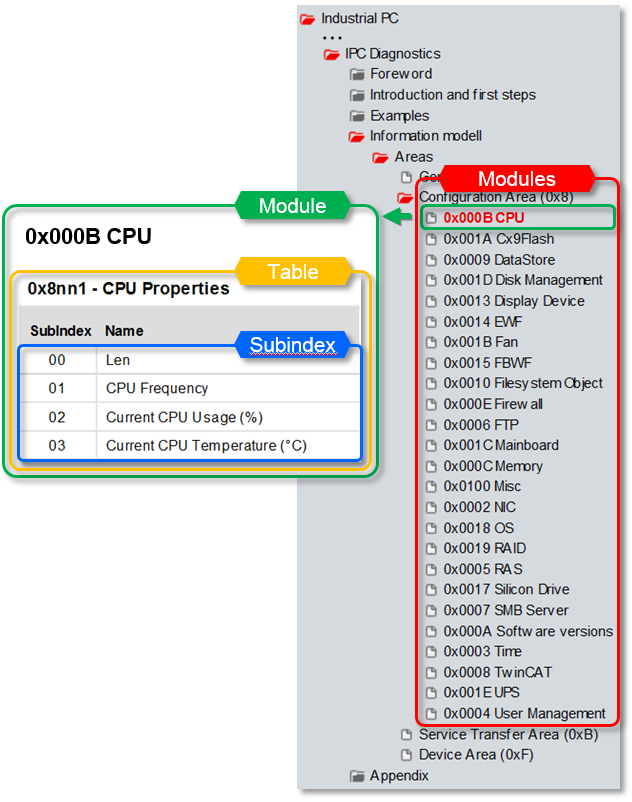

# TwinCAT MDP Client 

[](https://github.com/philippleidig/twincat-mdp-client/blob/main/LICENSE.md) 


Contains a MDP client implementation for the [Beckhoff Device Manager](https://infosys.beckhoff.com/english.php?content=../content/1033/devicemanager/262978315.html&id=2272923899604552966) communication protocol based on the TwinCAT.Ads.AdsClient. 
The Root object is the TwinCAT.MDP.MdpClient to communicate with the Beckhoff Device Manager via ADS. Use TwinCAT.Mdp.Reactive for reactive extensions.

Since the official [Beckhoff MDP client for C#](https://infosys.beckhoff.com/english.php?content=../content/1033/devicemanager/262967819.html&id=6522845330547228144) only allows local access, remote access is also possible with TwinCAT.Mdp.MdpClient

## Requirements

.NET 5.0, .NET Core 3.1, .NET Framework 4.61 or .NET Standard 2.0 compatible SDK or later.
A TwinCAT 3.1.4024 Build (XAE, XAR or ADS Setup) or alternatively the Beckhoff.TwinCAT.AdsRouterConsole Application on Non-TwinCAT systems to route ADS communication.

### TwinCAT Version >= 4024.10
Because the Beckhoff.TwinCAT.Ads Version 5.X uses internal interfaces that are available only from TwinCAT 4024.10 on, an appropriate version must be installed locally. The package doesn't work with older installations. An alternativ approach for some use cases is to use the 'Beckhoff.TwinCAT.Ads.AdsRouterConsole' / 'Beckhoff.TwinCAT.TcpIpRouter' packages to establish your own router.

### Systems without TwinCAT Installation
Install the 'Beckhoff.TwinCAT.Ads.AdsRouterConsole' package from Nuget.org:

```
PS> nuget install Beckhoff.TwinCAT.Ads.AdsRouterConsole
```

See [Beckhoff.TwinCAT.Ads](https://www.nuget.org/packages/Beckhoff.TwinCAT.Ads/) for further documentation.


## Usage

see [Beckhoff Infosys](https://infosys.beckhoff.com/english.php?content=../content/1033/devicemanager/262978315.html&id=2272923899604552966) for detailed information


### Basic 

```cs
using( MdpClient client = new MdpClient() ) 
{
    client.Connect("192.168.1.244.1.1");

    var cpuUsage = client.ReadParameter<ushort>(ModuleType.CPU, 1, 2);
    var cpuUsageAsync = await client.ReadParameterAsync<ushort>(ModuleType.CPU, 1, 2, CancellationToken.None);
    var cpuTemp = client.ReadParameter(ModuleType.CPU, 1, 3, typeof(short));
    var cpuTempAsync = await client.ReadParameterAsync(ModuleType.CPU, 1, 3, typeof(short), CancellationToken.None);
    var osVersion = client.ReadParameter<uint>(ModuleType.OS, 1, 3);

}
```

### Reactive 

```cs
using( MdpClient client = new MdpClient() ) 
{
    client.Connect("192.168.1.244.1.1");

    client.WhenConnectionStateChanges()
          .Subscribe(x => Console.WriteLine(x));

    client
        .PollParameter(ModuleType.CPU, 1, 1, typeof(int), TimeSpan.FromSeconds(1))
        .Subscribe(i => Console.WriteLine(i));

    client.WhenValueChanged(ModuleType.OS, 2, 1, typeof(ulong))
          .Subscribe(i => Console.WriteLine(i));
}
```

### How to determine table und sub index

see [MDP information model](https://infosys.beckhoff.com/english.php?content=../content/1033/devicemanager/262982923.html&id=4417408165722882460)




## License

- [License](./LICENSE.md)